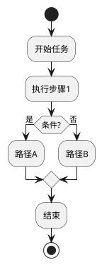
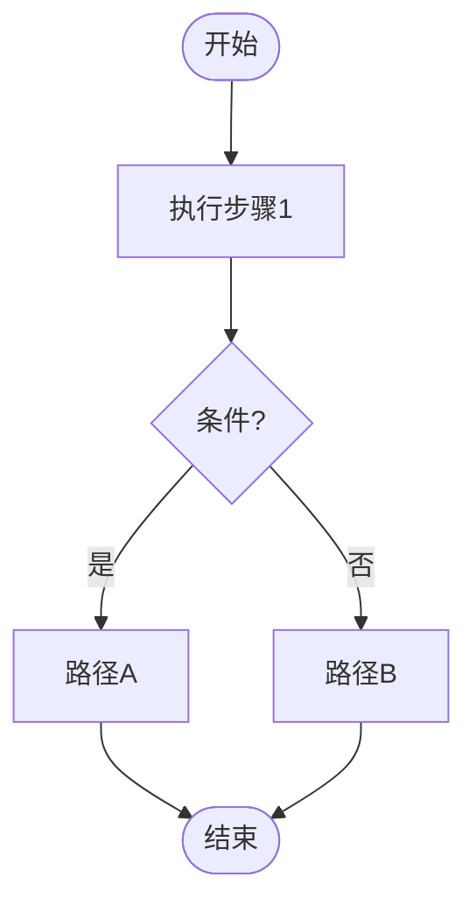
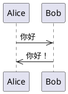
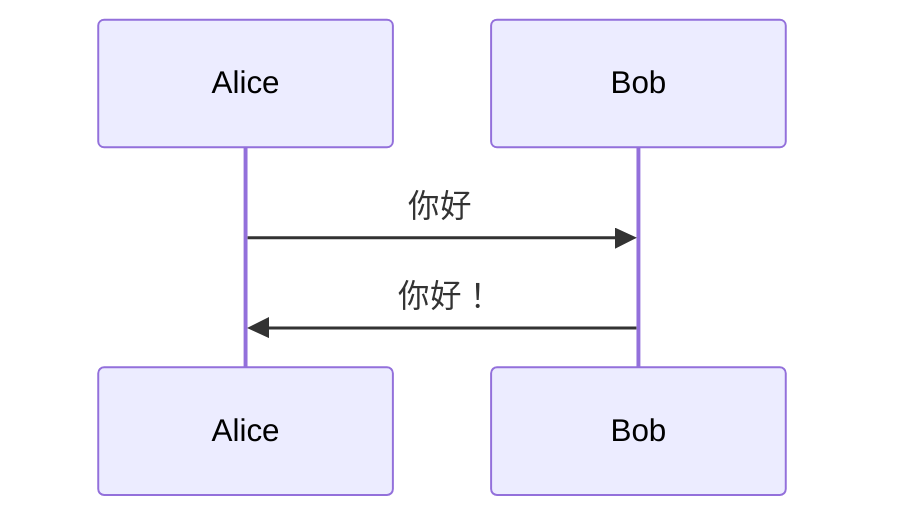

# Markdown Graph Viewer - 智能图表调度器

当用户请求生成图表时，**先读取本文件分析意图和输出方式**，按决策树确定输出策略。

**输出原则：只显示渲染后的图，不显示源码。** HTML文件双击打开即为图，无需任何插件。

---

## 输出策略

每个子 Skill 按其输出类型分为三种策略：

| 策略 | 说明 | 输出 |
|------|------|------|
| **Mermaid** | 可转换为 Mermaid，飞书文本绘图组件直接渲染，可编辑 | ✅ 输出 Mermaid 代码块 |
| **截图** | 无法转 Mermaid，用渲染工具生成 PNG | ✅ 输出 PNG 图片 |
| **手动重建** | 需要用户根据结构信息在飞书手动重建 | ⚠️ 提供结构清单 |

---

## 子Skill飞书兼容性速查

| 子Skill | 输出格式 | 飞书策略 | 可编辑 |
|---------|---------|---------|--------|
| `archimate` | PlantUML | 截图 | ❌ |
| `architecture` | HTML/CSS | 截图 | ❌ |
| `bpmn` | PlantUML BPMN | 截图（Mermaid部分支持） | ❌ |
| `canvas` | JSON | 截图 | ❌ |
| `cloud` | PlantUML | 截图 | ❌ |
| `data-analytics` | PlantUML | 截图 | ❌ |
| `graphviz` | DOT | 截图 | ❌ |
| `infocard` | HTML | 截图 | ❌ |
| `infographic` | 纯文本模板 | 截图 | ❌ |
| `iot` | PlantUML | 截图 | ❌ |
| `mindmap` | PlantUML @startmindmap | 截图 + 结构清单 | ⚠️ 手动重建 |
| `network` | PlantUML | 截图 | ❌ |
| `security` | PlantUML | 截图 | ❌ |
| `uml` | PlantUML | 截图 | ❌ |
| `vega` | JSON | 截图 | ❌ |

---

## 决策流程

### Step 1: 分析需求

读取用户需求，确定要生成的图类型。

### Step 2: 选择子Skill

按子Skill一览表选择合适的子Skill，读取其SKILL.md。

### Step 3: 确定输出策略

```
IF 子Skill是 "bpmn" 或 "uml":
    → 检查是否可转为 Mermaid（见下方Mermaid转换规则）
    → IF 可转:
        → 生成 Mermaid 代码块
        → 同时生成 PlantUML 代码块（备用）
    → IF 不可转:
        → 生成截图（PlantUML渲染PNG）
ELIF 子Skill是 "mindmap":
    → 生成截图（PlantUML渲染PNG）
    → 额外提供"节点结构清单"（供用户在飞书手动重建）
ELIF 子Skill是 "infographic":
    → 尝试转 Mermaid（时间线/流程类）
    → IF 不可转，截图
ELSE:
    → 截图（PlantUML/HTML渲染PNG）
```

## Step 4: 执行生成

**PlantUML 渲染为 PNG**：
```bash
plantuml -Tpng diagram.puml -o /output/path/
```

**HTML 截图渲染为 PNG**（Playwright）：
```bash
python3 ~/.openclaw/workspace/skills/markdown-graph-viewer/scripts/render_to_png.py \
    --type html \
    --input /path/to/diagram.html \
    --output /path/to/diagram.png
```

**PlantUML/HTML → 可双击打开的 HTML**：
```bash
python3 ~/.openclaw/workspace/skills/markdown-graph-viewer/scripts/md_to_html.py \
    --input /path/to/diagram.md \
    --output /path/to/diagram.html
```

### md_to_html.py 转换说明

将 `.md`（含 PlantUML 或 HTML 图表代码）转换为**可直接双击打开的 `.html`** 文件。

**输出特性**：
- 只显示渲染后的图，无源码
- **滚轮缩放 + 左键拖动平移**（通过 svg-pan-zoom 实现）
- 全屏查看，背景居中

**支持的文件类型**：
| 子Skill | 转换方式 |
|---------|---------|
| `archimate/bpmn/cloud/data-analytics/iot/network/security/uml/mindmap` | PlantUML → 本地SVG内嵌HTML + svg-pan-zoom（离线可用） |
| `architecture` | HTML 提取 → 独立 HTML 文件 + svg-pan-zoom |
| `infographic` | 使用已生成的 PNG 截图嵌入 |
| `canvas/graphviz` | PlantUML/DOT → HTML |
| `vega` | JSON → HTML（内嵌 Vega-Lite viewer）|
| `infocard` | HTML 提取 → 独立 HTML 文件 |

**转换后的 HTML 使用方式**：
- 双击直接在浏览器打开
- 滚轮缩放 + 左键拖动平移
- PlantUML/架构图：完全离线可用（SVG 内嵌）
- Mermaid/Vega：需要网络连接渲染

### Step 5: 整合输出

生成输出文件，同一任务保存两份：
- **源文件**（.md）：PlantUML/HTML/JSON 代码
- **渲染文件**（PNG 或 Mermaid 代码块）：飞书可直接使用

---

## Mermaid 转换规则

### ✅ 可转换的场景

**PlantUML 活动图（简单流程）** → Mermaid Flowchart：

↓ 转为
````markdown

````

**PlantUML 时序图（简单）** → Mermaid Sequence Diagram：

↓ 转为
````markdown

````

### ❌ 不可转换的场景

- PlantUML @startmindmap（思维导图）→ 无 Mermaid 对应
- BPMN 图 → Mermaid 不支持 BPMN 语法
- ArchiMate 架构图 → 无 Mermaid 对应
- 云架构（AWS/Azure/GCP 图标）→ 无 Mermaid 对应
- HTML/CSS 架构图 → 无 Mermaid 对应
- Vega/JSON 图表 → 无 Mermaid 对应
- DOT/Graphviz → 无 Mermaid 对应
- 任何使用 PlantUML 宏（mxgraph/*）的图 → 无法转换

### ⚠️ 转换判断标准

简单转换测试（满足以下全部条件才转换）：
1. 不使用 `@startmindmap`（思维导图）
2. 不使用 BPMN 宏（`mxgraph.bpmn.*`）
3. 不使用云服务图标（`mxgraph.aws*`, `mxgraph.azure*`, `mxgraph.gcp*`）
4. 不使用 PlantUML 皮肤参数（`skinparam`）
5. 节点数量 < 30

---

## mindmap 特殊处理：节点结构清单

对于 `mindmap` 子 Skill，除了生成截图外，**必须**额外输出节点结构清单，格式如下：

```markdown
## 🧠 思维导图节点结构清单

根节点: 药品稳定性研究
├── 一级: 稳定性计划
│   ├── 二级: 放样任务
│   └── 二级: 取样节点
├── 一级: 放样反馈
│   └── 二级: 反馈记录
└── 一级: 数据汇总
    ├── 二级: 自动采集
    └── 二级: 报告生成

**在飞书重建步骤：**
1. 打开飞书文档 → 插入 → 思维导图
2. 输入根节点文本
3. 按层级逐个添加子节点（参考上方结构）
```

**解析规则**：
- `*` = 根节点
- `**` = 一级子节点
- `***` = 二级子节点
- `****` 及以下 = 更深层级
- `left side` / `right side` 决定分支方向（可标注在清单中）

---

## 截图渲染优先级

当需要截图时，按以下顺序尝试：

1. **PlantUML 渲染 PNG**（PlantUML 系 Skill）：
   ```bash
   plantuml -Tpng diagram.puml -o /output/path/
   ```

2. **Playwright + Chrome 渲染 PNG**（HTML 系 Skill）：
   ```python
   from playwright.sync_api import sync_playwright
   with sync_playwright() as p:
       browser = p.chromium.launch(args=['--no-sandbox', '--disable-gpu'])
       page = browser.new_page(viewport={'width': 1200, 'height': 800})
       page.set_content(html_code, wait_until='networkidle')
       page.screenshot(path='output.png', full_page=True)
       browser.close()
   ```

3. **Mermaid.live 在线渲染**（如本地工具不可用）：
   - 访问 https://mermaid.live
   - 粘贴 Mermaid 代码
   - 导出 PNG

---

## 输出文件命名规范

```
{图表名}_{子Skill类型}.md        ← 源码
{图表名}_{子Skill类型}.html      ← 可双击打开的HTML（自动生成）
{图表名}_{子Skill类型}_截图.png  ← PNG截图（截图策略时）
{图表名}_{子Skill类型}_mermaid.md ← Mermaid源码（Mermaid策略时）
```

例如：
- `架构图_architecture.md` + `架构图_architecture.html`
- `流程图_bpmn.md` + `流程图_bpmn.html` + `流程图_bpmn_截图.png`
- `思维导图_mindmap.md` + `思维导图_mindmap.html` + `思维导图_mindmap_截图.png`
- `流程图_bpmn_mermaid.md` ← Mermaid可直接复制到飞书

---

## 子Skill路径速查

| 子Skill | 路径 |
|---------|------|
| `archimate` | `/home/wangyc/.agents/skills/archimate/SKILL.md` |
| `architecture` | `/home/wangyc/.agents/skills/architecture/SKILL.md` |
| `bpmn` | `/home/wangyc/.agents/skills/bpmn/SKILL.md` |
| `canvas` | `/home/wangyc/.agents/skills/canvas/SKILL.md` |
| `cloud` | `/home/wangyc/.agents/skills/cloud/SKILL.md` |
| `data-analytics` | `/home/wangyc/.agents/skills/data-analytics/SKILL.md` |
| `graphviz` | `/home/wangyc/.agents/skills/graphviz/SKILL.md` |
| `infocard` | `/home/wangyc/.agents/skills/infocard/SKILL.md` |
| `infographic` | `/home/wangyc/.agents/skills/infographic/SKILL.md` |
| `iot` | `/home/wangyc/.agents/skills/iot/SKILL.md` |
| `mindmap` | `/home/wangyc/.agents/skills/mindmap/SKILL.md` |
| `network` | `/home/wangyc/.agents/skills/network/SKILL.md` |
| `security` | `/home/wangyc/.agents/skills/security/SKILL.md` |
| `uml` | `/home/wangyc/.agents/skills/uml/SKILL.md` |
| `vega` | `/home/wangyc/.agents/skills/vega/SKILL.md` |
